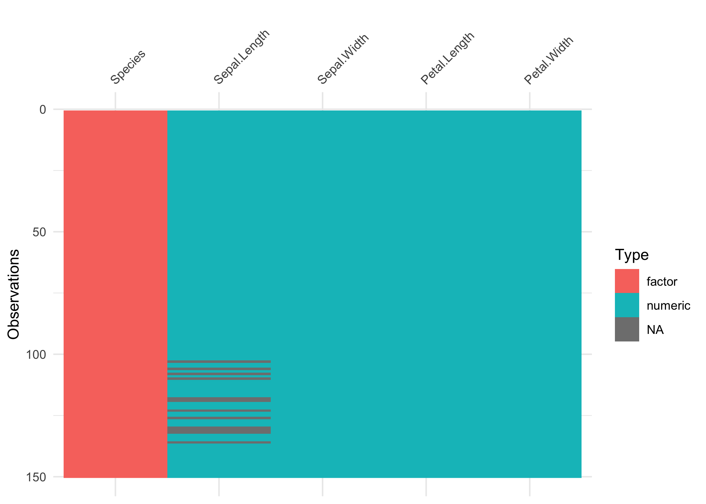

2020-02-23
================

# `visdat::vis_dat()` - i know this one\!

``` r
library(visdat)

# Add some missing data to iris
iris[["Sepal.Length"]] <- ifelse(iris[["Sepal.Length"]] > 7,
                                 NA_real_,
                                 iris[["Sepal.Length"]])

# vis_dat gives you a visual overview of your data
# it contains information on column classes and missing values
vis_dat(iris)
```



# `prismatic::check_color_blindness()` - new to me\!

``` r
library(RColorBrewer)
library(prismatic)

red_green <- brewer.pal(10, "RdYlGn")

# Use check_color_blindness to approximate how a colour palette appears to 
# those with different kinds of colour deficiencies
check_color_blindness(red_green)
```


