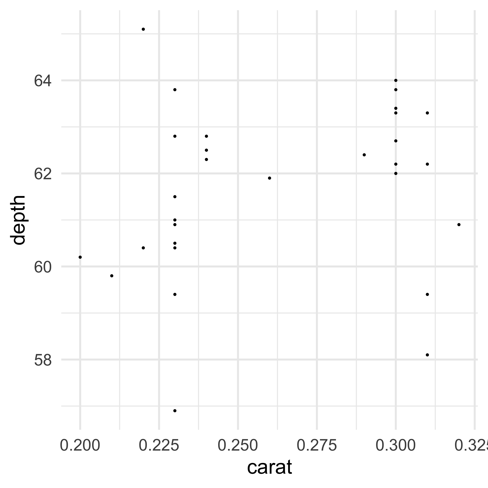
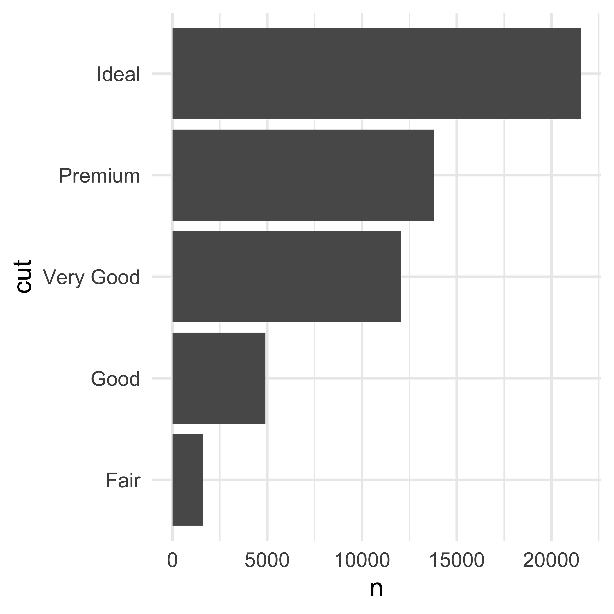
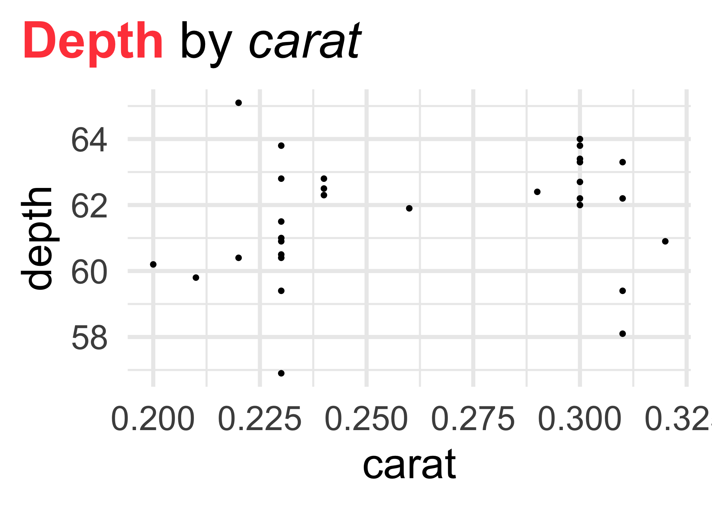

2020-03-26
================

# `ggplot2::theme_set()` - i know this one\!

``` r
library(ggplot2)

# Use theme_set() to apply a theme to all your plots!
# Bonus, use `base_size` to scale up the plot font!
theme_set(theme_minimal(base_size = 30)) 

ggplot(head(diamonds, 30), aes(x = carat, y = depth)) + 
  geom_point()
```



``` r
library(dplyr)

diamonds %>%
  count(cut) %>%
  ggplot(aes(x = cut, y = n)) + 
  geom_col() + 
  coord_flip()
```



# `ggtext::element_markdown()` - new to me\!

``` r
library(ggtext) # from github: https://github.com/wilkelab/ggtext
library(ggplot2)

# Use element_markdown() to enable using markdown and html styling in plot elements!
ggplot(head(diamonds, 30), aes(x = carat, y = depth)) + 
  geom_point() + 
  labs(title = "<b style='color:#FF4848'>Depth</b> by *carat*") + 
  theme(plot.title = element_markdown(),
        plot.title.position = "plot") # Bonus tip to totally left align the title!
```


